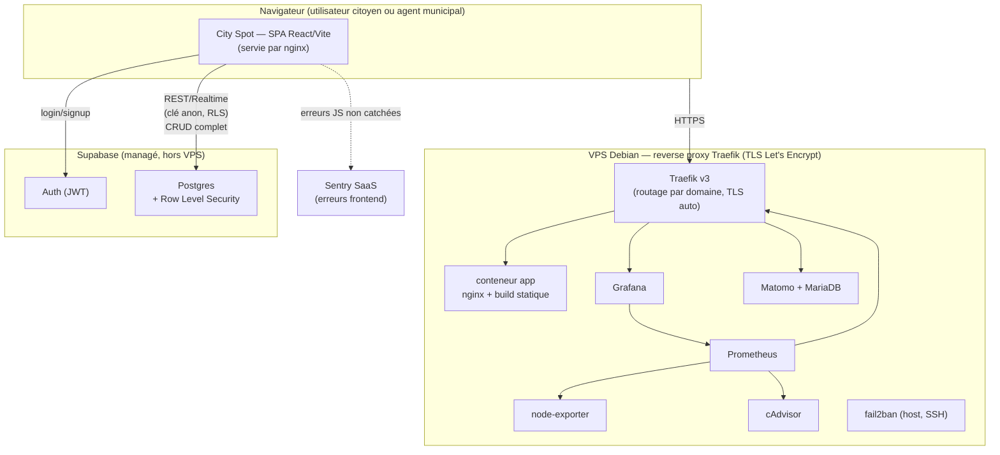

# Architecture — City Spot

## 1. Objet du document

Ce document présente l'architecture technique de City Spot : les composants du système, leurs responsabilités, comment ils communiquent, et où se trouvent les frontières de confiance et de sécurité. Il répond au critère **C2.2.1** de la grille d'évaluation, *« l'architecture logicielle est présentée »*, qui n'avait jusqu'ici aucun document dédié (le contenu existait, dispersé entre `README.md`, `MANUEL_DEPLOIEMENT.md` et `SECURITE.md` — ce document les consolide sans les dupliquer, en renvoyant vers eux pour le détail).

## 2. Vue d'ensemble

City Spot est une **SPA (Single Page Application)** qui parle directement à un backend managé (**Supabase** : Postgres + Auth + stockage), sans aucune API applicative intermédiaire — toutes les opérations (y compris la suppression d'un signalement) passent par le client Supabase et sont arbitrées par la Row Level Security en base, pas par du code serveur maison. Le tout est packagé dans un conteneur Docker unique (nginx servant les fichiers statiques buildés), déployé derrière un reverse proxy Traefik sur un VPS, avec une pile de supervision à côté.

## 3. Frontend — SPA

| Élément | Choix |
|---|---|
| Langage | TypeScript |
| Framework UI | React 19 |
| Bundler / dev server | Vite 6 (transpileur SWC) |
| Routage | `react-router` (`createBrowserRouter`), routes chargées en lazy (`src/routes.ts`) |
| Composants UI | Radix UI (primitives accessibles : dialog, tabs, switch, radio-group...) + composants applicatifs sous `src/components/` |
| État serveur | pas de couche de cache dédiée (pas de React Query) — appels directs via `src/services/` et hooks (`useIssues.ts`) |
| Auth côté client | `src/context/UserContext.tsx` — source de vérité du rôle : `public.users.role` (pas `auth.users.user_metadata`, cf. `PLAN_CORRECTION_BOGUES.md` BUG-12) |

**Structure de `src/`** :
- `components/` — écrans (`MapView`, `CreatePost`, `PostDetail`, `MunicipalView`, `Profile`, `Settings`, `LoginPage`, `Layout`) et primitives UI (`components/ui/`).
- `services/` — accès aux données : `authService.ts` (Supabase Auth), `issuesService.ts` (CRUD signalements, votes, tâches, matériel).
- `context/` — `UserContext.tsx`, seule source de l'utilisateur courant et de son rôle dans toute l'app.
- `lib/` — `supabase.ts` (client + garde de config, cf. §5), `sentry.ts` (init conditionnelle), `postStatus.ts` (logique de transition de statut d'un signalement).
- `hooks/`, `schemas/` (validation Zod), `constants/`, `types/` — support.

Routes (`src/routes.ts`) : `/login` (hors layout), puis sous `Layout` : `/` (carte), `/create` et `/create/:id` (création/édition), `/post/:id` (détail), `/profile`, `/settings`, `/municipal`. `Layout.tsx` porte la garde de rôle qui bloque `/municipal` aux comptes non municipaux (BUG-01).

## 4. Backend — Supabase (managé)

Pas de serveur applicatif : le frontend interroge directement Postgres via l'API REST de Supabase, avec la clé publique (anon key) et l'authentification par JWT. La sécurité par ligne (**Row Level Security**) est la seule barrière entre "un utilisateur authentifié quelconque" et "les données d'un autre utilisateur" — c'est elle qui fait tout le travail que ferait normalement une couche API. Le mapping table par table (schéma exact dans `src/lib/supabase.ts`, type `Database`) :

| Table | Lecture | Écriture |
|---|---|---|
| `issues` | ouverte à tout utilisateur connecté | création/modification/suppression réservées au créateur (`auth.uid() = created_by`) |
| `tasks` / `materials` | ouverte | insert/delete réservés au créateur du signalement parent (sous-requête sur `issues.created_by`) |
| `comments` / `votes` | ouverte | insertion uniquement en tant que soi-même (`auth.uid() = id_user`), pas d'update/delete |
| `users` | — | profil du propriétaire uniquement, synchronisé à l'inscription par un trigger (`handle_new_user`) |

Historique complet des migrations et de leur raison d'être : `PLAN_CORRECTION_BOGUES.md` (BUG-09, BUG-10, BUG-13 notamment — toutes les tables ont d'abord porté une policy `"all for all"` héritée du prototypage, retirée et remplacée table par table).

**Pas de fonction serveur** : le projet a porté une Edge Function `delete-issue` jusqu'au 2026-07-19, écrite avant que `issues` porte une policy RLS de suppression — elle revérifiait manuellement, côté serveur, que l'appelant était bien le propriétaire avant de supprimer. Une fois la RLS de `issues` étendue à `DELETE` (BUG-10, même règle `auth.uid() = created_by` que pour `UPDATE`), la fonction faisait exactement le même travail que la base fait déjà nativement, sans rien y ajouter (pas de cascade, pas de nettoyage de stockage) : elle a été retirée (`src/services/issuesService.ts` appelle directement `.from('issues').delete()`, cf. `CHANGELOG.md`). PostgREST ne distingue pas explicitement "refusé" de "rien à supprimer" sur un `DELETE` filtré par RLS (toujours `HTTP 200`) : `deleteIssue()` détecte le refus en vérifiant que le tableau de lignes supprimées (`.select('id')`) n'est pas vide, et lève la même erreur qu'avant côté UI.

## 5. Configuration et secrets

`src/lib/supabase.ts` centralise la création du client : `getSupabaseClient()` renvoie `null` (pas d'exception) si `VITE_SUPABASE_URL`/`VITE_SUPABASE_ANON_KEY` sont absents (mode dégradé, utilisé par la CI et les tests) et **rejette explicitement toute clé commençant par `sb_secret_`** — aucune clé service-role ne peut être chargée côté navigateur même par erreur de configuration. `src/lib/sentry.ts` suit le même patron (`if (!dsn) return;`).

## 6. Déploiement et infrastructure

Détail complet (protocole, commandes, critères de qualité/perf) : `MANUEL_DEPLOIEMENT.md`. Résumé architectural :

- **Build** : `Dockerfile` multi-stage — étape 1 (`node:22-alpine`) build Vite avec les secrets Supabase injectés via `--mount=type=secret` (jamais en clair dans les layers de l'image) et le DSN Sentry en simple build-arg (non sensible) ; étape 2 (`nginx:alpine-slim`) sert uniquement les fichiers statiques buildés — l'image finale ne contient ni Node ni le code source.
- **Registre** : image poussée sur GHCR (`ghcr.io/auguste-p/cityspot`).
- **Reverse proxy** : Traefik v3 sur le VPS — routage par domaine via labels Docker, TLS automatique (Let's Encrypt, HTTP-01), un seul point d'entrée public pour tous les services routés (`projet-cityspot.fr`, `grafana.…`, `matomo.…`).
- **Supervision** (ajoutée en juillet 2026, cf. `CHANGELOG.md` v1.1.0) : Prometheus (+ node-exporter pour l'hôte, cAdvisor pour les conteneurs, métriques Traefik) et Grafana pour la visualisation ; Sentry (SaaS) pour les erreurs frontend ; Matomo (self-hosted) pour l'analytics ; fail2ban sur l'hôte pour le brute-force SSH.
- **CI/CD** : `.github/workflows/ci.yml` (tests + build à chaque push/PR vers `main`) et `.github/workflows/deploy.yml` (build+push GHCR puis déploiement SSH sur le VPS, déclenché par un tag `vX.Y.Z`) — les deux vérifiés en conditions réelles (`v1.0.1`, `v1.1.0`).

## 7. Frontières de confiance — synthèse

- **Navigateur → Supabase** : frontière de confiance unique. Le navigateur n'est jamais fiable ; toute autorisation réelle est appliquée côté Postgres (RLS), jamais côté React (les gardes UI comme `Layout.tsx` améliorent l'ergonomie mais ne sont pas une mesure de sécurité — cf. `SECURITE.md`).
- **VPS → Supabase** : aucune communication serveur-à-serveur avec des identifiants privilégiés ; le VPS ne fait qu'héberger le frontend statique et les outils de supervision, il n'a lui-même aucun accès élevé à la base.

Mapping détaillé des mesures de sécurité (OWASP Top 10) : `SECURITE.md`. Écarts assumés sur ce périmètre : `GRILLE_EVALUATION.md` §4.
