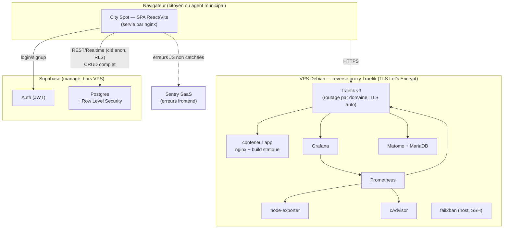

# Dossier de certification — City Spot

**Candidat** : Auguste P. — **Projet** : City Spot (signalement citoyen de dégradations urbaines)
**Dépôt** : `github.com/Auguste-p/Cityspot` — **Version en production** : `v1.2.1` — **Date** : 20/07/2026

> Ce dossier consolide, en un seul document, l'ensemble des livrables attendus pour la simulation de situation de travail. Chaque section renvoie vers le document source complet du dépôt pour le détail exhaustif — ce dossier en présente la synthèse et les éléments de preuve essentiels. Index complet critère → document : [`GRILLE_EVALUATION.md`](./GRILLE_EVALUATION.md).

---

## Sommaire

1. Présentation du projet
2. Présentation d'un des prototypes réalisés
3. Architecture logicielle
4. Frameworks et paradigmes de développement
5. Environnement de développement
6. Protocole d'intégration continue
7. Protocole de déploiement continu
8. Critères de qualité et de performance
9. Jeu de tests unitaires couvrant une fonctionnalité demandée
10. Mesures de sécurité
11. Accessibilité
12. Historique des versions
13. Dernière version fonctionnelle
14. Cahier de recettes
15. Plan de correction des bogues
16. Manuel de déploiement
17. Manuel d'utilisation
18. Manuel de mise à jour

---

## 1. Présentation du projet

City Spot est une application web permettant à des citoyens de **signaler des dégradations sur la voie publique** (nid-de-poule, éclairage défectueux, mobilier urbain cassé…), de **voter** pour prioriser les signalements des autres, et d'en suivre le traitement. Les agents municipaux disposent d'une **vue dédiée** pour piloter l'ensemble des signalements de leur collectivité.

Le projet part d'un bundle de code généré depuis Figma Make, très largement refactoré et complété au fil du développement : ajout du backend réel (Supabase), de l'authentification, de la carte interactive, de la sécurité (RLS, OWASP), de l'accessibilité (RGAA), d'une suite de tests, d'un pipeline CI/CD complet et d'un déploiement en production sur un VPS dédié, avec supervision.

**Techniquement** : React 19 + TypeScript + Vite côté frontend, Supabase (Postgres managé + Auth) côté backend, sans serveur applicatif intermédiaire — toute la logique d'autorisation est portée par la sécurité au niveau ligne (Row Level Security) de Postgres. Déploiement Docker sur un VPS OVH, reverse proxy Traefik, CI/CD GitHub Actions.

---

## 2. Présentation d'un des prototypes réalisés

### 2.1 Parcours citoyen

1. **Inscription / connexion** (`/login`) — un citoyen crée un compte (nom, ville — avec recherche géographique assistée, email, mot de passe) ou se connecte. Une session valide redirige vers la carte.
2. **Carte interactive** (`/`) — affichage de tous les signalements sous forme de marqueurs colorés selon leur statut (en vote / en cours / terminé), sur un fond OpenStreetMap. La carte se centre automatiquement sur la ville renseignée à l'inscription. Un bouton "Me localiser" recentre sur la position réelle de l'utilisateur.
3. **Créer un signalement** (`/create`) — photo, titre, description, **recherche d'adresse avec suggestions** (rues, lieux nommés, pas seulement des villes) pour positionner précisément le marqueur, type de voie (publique/privée, avec sous-cas propriétaire ou non), tâches et matériel nécessaires.
4. **Détail d'un signalement** (`/post/:id`) — vote pour/contre avec niveau d'engagement, jauge de progression vers le seuil de bascule "en cours", liste des tâches (cochables une fois le projet lancé, par le créateur uniquement), commentaires, partage. Le créateur peut modifier ou supprimer son propre signalement.
5. **Vue municipale** (`/municipal`, agents municipaux uniquement) — statistiques globales, filtres par catégorie (voirie, éclairage, sécurité, propreté, espaces verts, mobilier urbain), onglets par statut.
6. **Profil et paramètres** — informations du compte, préférences (notifications, visibilité du profil), déconnexion.

### 2.2 Fonctionnalité illustrée en détail : la recherche d'adresse

Introduite en v1.2.0 pour corriger un bogue réel (tout nouveau signalement était créé avec des coordonnées `(0, 0)`), cette fonctionnalité illustre bien la démarche du projet : un signalement doit avoir une position GPS fiable pour que son marqueur apparaisse au bon endroit sur la carte.

- Le champ "Localisation" propose une liste de suggestions au fil de la frappe (debounce 400 ms), via l'API **Photon** (mêmes données OpenStreetMap que le géocodage inverse déjà utilisé pour "Me localiser", mais pensée pour l'autocomplétion : rues, numéros, lieux nommés).
- Si l'utilisateur ne sélectionne aucune suggestion, une géolocalisation de secours du texte saisi est tentée à la soumission, avant de retomber sur une ville par défaut — jamais de retour silencieux à `(0, 0)`.
- La même mécanique est réutilisée pour la ville à l'inscription (filtrée aux seuls lieux de type ville/commune, pour garantir une ville reconnue plutôt qu'une adresse quelconque), dont les coordonnées servent ensuite à centrer automatiquement la carte à la connexion.

Capture d'écran et détail pas-à-pas de chaque écran : [`MANUEL_UTILISATION.md`](./MANUEL_UTILISATION.md).

---

## 3. Architecture logicielle

City Spot est une **SPA (Single Page Application)** qui parle directement à un backend managé (Supabase : Postgres + Auth), **sans API applicative intermédiaire** — toutes les opérations, y compris la suppression d'un signalement, passent par le client Supabase et sont arbitrées par la Row Level Security en base, pas par du code serveur maison.



### 3.1 Frontend

| Élément | Choix |
|---|---|
| Langage | TypeScript |
| Framework UI | React 19 |
| Bundler / dev server | Vite 6 (transpileur SWC) |
| Routage | `react-router`, routes chargées en *lazy* (`src/routes.ts`) |
| Composants UI | Radix UI (primitives accessibles) + composants applicatifs |
| Auth côté client | `UserContext.tsx` — source de vérité du rôle et de la ville : `public.users` |

**Structure de `src/`** : `components/` (écrans + primitives UI), `services/` (accès aux données : `authService.ts`, `issuesService.ts`), `context/` (`UserContext.tsx`), `lib/` (`supabase.ts`, `sentry.ts`, `geocode.ts`, `postStatus.ts`), `hooks/`, `schemas/` (validation Zod), `constants/`, `types/`.

### 3.2 Backend — Supabase (managé)

Pas de serveur applicatif : le frontend interroge directement Postgres via l'API REST de Supabase (clé publique + JWT). La **Row Level Security** est la seule barrière entre "un utilisateur authentifié quelconque" et "les données d'un autre utilisateur".

| Table | Lecture | Écriture |
|---|---|---|
| `issues` | ouverte à tout utilisateur connecté | création/modification/**suppression** réservées au créateur (`auth.uid() = created_by`) |
| `tasks` / `materials` | ouverte | insert/delete réservés au créateur du signalement parent |
| `comments` / `votes` | ouverte | insertion uniquement en tant que soi-même |
| `users` | profil du propriétaire uniquement | profil du propriétaire uniquement, synchronisé à l'inscription par un trigger serveur (`handle_new_user`) |

**Pas de fonction serveur** : une Edge Function `delete-issue` a existé jusqu'à ce que la RLS de `issues` soit étendue au `DELETE` (même règle que pour `UPDATE`) — elle faisait alors exactement le même travail que la base fait nativement, sans rien y ajouter. Retirée en v1.2.0.

### 3.3 Frontières de confiance

- **Navigateur → Supabase** : frontière de confiance unique. Le navigateur n'est jamais fiable ; toute autorisation réelle est appliquée côté Postgres (RLS), jamais côté React (les gardes UI comme `Layout.tsx` améliorent l'ergonomie mais ne sont pas une mesure de sécurité).
- **VPS → Supabase** : aucune communication serveur-à-serveur avec des identifiants privilégiés ; le VPS héberge uniquement le frontend statique et la supervision.

Détail complet, y compris la configuration/secrets : [`ARCHITECTURE.md`](./ARCHITECTURE.md).

---

## 4. Frameworks et paradigmes de développement

| Paradigme / outil | Usage dans le projet |
|---|---|
| **Composants fonctionnels + hooks** (React) | Toute l'UI ; pas de composant classe. Hooks personnalisés (`useIssues`, `useVotes`) encapsulent l'accès aux données et l'état de chargement |
| **Contexte React** | `UserContext` — état d'authentification et profil partagés dans toute l'arborescence, sans prop-drilling |
| **Validation déclarative** (Zod) | Schémas de formulaire (`formSchemas.ts`) définissant à la fois la validation et le typage TypeScript inféré |
| **Programmation orientée données déclarative** | Row Level Security Postgres plutôt que des `if` de contrôle d'accès dispersés dans le code applicatif |
| **Composition de composants accessibles** | Radix UI (primitives *headless*) plutôt que des composants stylés sans sémantique ARIA |
| **Chargement paresseux (code-splitting)** | Chaque route est un chunk JS séparé (`react-router` + `import()` dynamique), réduisant le poids initial du bundle |
| **Tests orientés comportement** | Testing Library (rendu + interactions utilisateur), pas de test d'implémentation interne |

---

## 5. Environnement de développement

| Élément | Choix |
|---|---|
| Éditeur | Visual Studio Code |
| Langage | TypeScript |
| Compilateur / transpileur | SWC (`@vitejs/plugin-react-swc`), intégré à Vite |
| Bundler / serveur de dev | Vite 6 (`npm run dev`, port 5173) |
| Runtime | Node.js 22 (aligné entre CI et `Dockerfile`) |
| Gestionnaire de paquets | npm |
| Gestion de sources | Git, GitHub (`Auguste-p/Cityspot`) |
| Tests | Vitest + Testing Library + axe-core |

```bash
npm install
npm run dev            # serveur de dev, http://localhost:5173
npm test                # suite de tests (unitaires + accessibilité RGAA)
npm run test:coverage   # idem + rapport de couverture
npm run typecheck       # tsc --noEmit — SWC ne vérifie pas les types, ce script si
npm run lint            # eslint . — typescript-eslint + react-hooks + jsx-a11y
npm run build            # build de production
```

`.env` contient `VITE_SUPABASE_URL` / `VITE_SUPABASE_ANON_KEY`. Sans ces variables, l'app bascule sur des données locales de secours, ce qui permet de développer sans base réelle.

Typage et lint sont tous deux vérifiés à chaque push/PR depuis le 2026-07-20 (`tsconfig.json` + `tsc --noEmit`, `eslint.config.js` + `eslint`, §6) : plus d'écart résiduel sur ce point.

Détail complet : [`MANUEL_DEPLOIEMENT.md`](./MANUEL_DEPLOIEMENT.md) §2.

---

## 6. Protocole d'intégration continue

Chaque push ou pull request vers `main` déclenche `.github/workflows/ci.yml` :

1. `npm ci` (installation à partir de `package-lock.json`, committé, cf. §16).
2. `npm audit --audit-level=high` — le build échoue si une vulnérabilité haute/critique est détectée dans les dépendances (ferme le point OWASP A06, cf. §10).
3. `npm run typecheck` (`tsc --noEmit`) — SWC (utilisé pour builder) ne vérifie jamais les types ; c'est la seule étape qui le fait.
4. `npm run lint` (`eslint .`) — `typescript-eslint`, `eslint-plugin-react-hooks`, `eslint-plugin-jsx-a11y`.
5. `npm run test:coverage` — 121 tests, rapport de couverture déposé en artefact CI (`coverage-report`, 30 jours de rétention).
6. `npm run build` — build de production.

Un test ou un build en échec **bloque la fusion** sur `main`. Ce pipeline couvre l'intégration continue (test + build) mais ne publie pas l'image Docker — c'est le rôle du pipeline de déploiement continu (§7).

---

## 7. Protocole de déploiement continu

`.github/workflows/deploy.yml` se déclenche sur le push d'un **tag Git `vX.Y.Z`** et enchaîne deux jobs :

1. **`build-and-push`** — build l'image Docker (secrets Supabase injectés via `--secret`, jamais en clair) et la pousse sur le **GitHub Container Registry** (`ghcr.io/auguste-p/cityspot`), taguée `latest` et avec le numéro de version.
2. **`deploy`** — connexion SSH au VPS, `docker compose pull && docker compose up -d` dans `/opt/cityspot`.

**Sur le VPS**, plusieurs conteneurs tournent en permanence via `docker-compose.yml` : `app` (l'image ci-dessus), `traefik` (reverse proxy public, TLS Let's Encrypt automatique par domaine, découverte des services via labels Docker), la pile de supervision (`prometheus`/`node-exporter`/`cadvisor`/`grafana`), les analytics (`matomo`/`matomo-db`), et `fail2ban` sur l'hôte (anti brute-force SSH).

**Séquence complète d'une mise en production** :
1. Recette validée (§14), tag `vX.Y.Z` posé et poussé.
2. `deploy.yml` construit l'image, la pousse sur GHCR.
3. Connexion SSH, nouvelle image tirée, seul le conteneur `app` est remplacé — `traefik` n'est pas interrompu (pas de coupure TLS).
4. Vérification post-déploiement : accès HTTPS au domaine, logs du conteneur sans erreur.

Ce pipeline est **vérifié en conditions réelles**, pas seulement rédigé : déploiements effectifs depuis `v1.0.1`.

Détail complet (secrets requis, mise en place initiale du VPS, supervision) : [`MANUEL_DEPLOIEMENT.md`](./MANUEL_DEPLOIEMENT.md) §8.

---

## 8. Critères de qualité et de performance

| Axe | Critère | Mesure actuelle |
|---|---|---|
| Qualité — tests | Couverture de lignes ≥ 80 % | 81,27 % (`src` global), détail dans [`TESTS.md`](./TESTS.md) |
| Qualité — build | Le build de production doit réussir sans erreur | ✅ vérifié à chaque push/PR |
| Qualité — non-régression | La suite de tests doit être verte avant toute fusion | ✅ appliqué (121 tests) |
| Qualité — accessibilité | Conformité RGAA 4.1 sur tous les écrans | Détail §11 |
| Qualité — sécurité | Couverture OWASP Top 10 + dépendances | Détail §10, `npm audit` en CI |
| Performance — bundle | Limiter le poids du chunk principal | ~270 kB (contre 511 kB avant code-splitting par route) |

> **Limite assumée** : la mesure de performance (taille de bundle) a été faite une fois, manuellement — pas d'outil type Lighthouse CI branché en continu sur le pipeline à ce jour.

---

## 9. Jeu de tests unitaires couvrant une fonctionnalité demandée

**Fonctionnalité choisie : l'authentification** (`src/services/authService.ts`, testée dans `authService.test.ts`) — chemin critique de toute l'application, avec plusieurs garde-fous de sécurité ajoutés au fil des correctifs.

Extraits de tests représentatifs :

```ts
it('refuses to sign up when the email is already registered (auth.users or public.users)', async () => {
  const signUpMock = vi.fn();
  const rpc = vi.fn().mockResolvedValue({ data: true, error: null });
  mockedGetSupabaseClient.mockReturnValue({ auth: { signUp: signUpMock }, rpc } as any);

  await expect(signUp('a@b.com', 'pw', { name: 'A', city: 'Lyon' })).rejects.toThrow(
    'Un compte existe déjà avec cet email.',
  );
  expect(rpc).toHaveBeenCalledWith('email_exists', { check_email: 'a@b.com' });
  expect(signUpMock).not.toHaveBeenCalled();
});

it('resolves null instead of throwing when there is no session (anonymous visitor)', async () => {
  mockedGetSupabaseClient.mockReturnValue({
    auth: {
      getUser: vi.fn().mockResolvedValue({
        data: { user: null },
        error: { name: 'AuthSessionMissingError', message: 'Auth session missing!' },
      }),
    },
  } as any);

  await expect(getCurrentUser()).resolves.toBeNull();
});
```

Ce fichier de test couvre : inscription réussie, propagation des erreurs Supabase, garde-fou email déjà existant (avec vérification qu'`auth.signUp()` n'est *pas* appelé dans ce cas), transmission des coordonnées de ville via `user_metadata`, connexion, déconnexion, récupération de l'utilisateur courant (y compris le cas "visiteur anonyme", qui ne doit pas être traité comme une erreur), lecture/écriture du profil `public.users` — **15 tests**, tous en isolation (client Supabase entièrement mocké, aucun appel réseau réel).

**Bilan global de la suite** : 121 tests, 21 fichiers, dont les tests d'accessibilité RGAA (intégrés à la même suite, pas une commande séparée — une régression d'accessibilité fait échouer la CI comme n'importe quel autre bogue). Détail fichier par fichier, ce que chaque test vérifie et pourquoi : [`TESTS.md`](./TESTS.md).

---

## 10. Mesures de sécurité

Mapping explicite aux 10 catégories de risques de l'**OWASP Top 10 (édition 2021)** :

| Catégorie OWASP | Mesure en place |
|---|---|
| **A01 – Broken Access Control** | RLS Postgres sur toutes les tables exposées (lecture ouverte, écriture et suppression réservées au propriétaire) ; garde de route côté client sur `/municipal` |
| **A02 – Cryptographic Failures** | Aucune clé secrète/service-role ne peut être chargée côté client (rejet explicite si la clé commence par `sb_secret_`) ; mots de passe gérés par Supabase Auth |
| **A03 – Injection** | Toutes les requêtes passent par le client Supabase (requêtes paramétrées), aucune concaténation SQL manuelle ; validation stricte des formulaires (Zod) |
| **A04 – Insecure Design** | Tally de votes recalculé côté serveur par trigger (payload client falsifié ignoré) ; contrainte d'unicité sur les votes ; upload limité en taille/type |
| **A05 – Security Misconfiguration** | En-têtes HTTP de sécurité (nginx) ; secrets Docker injectés via `--secret` ; RLS activée par défaut sur toutes les tables |
| **A06 – Vulnerable Components** | `npm audit --audit-level=high` en CI, à chaque push/PR — le build échoue sur vulnérabilité haute/critique |
| **A07 – Authentication Failures** | Authentification déléguée à Supabase Auth, sessions JWT, pas de logique maison ; garde-fou anti-doublon d'email vérifiant à la fois `auth.users` et l'état applicatif |
| **A08 – Software and Data Integrity Failures** | CI bloque la fusion sur échec ; toute évolution de schéma passe par une migration versionnée relue |
| **A09 – Security Logging and Monitoring Failures** | Supervision infra (Prometheus/Grafana), erreurs frontend (Sentry), anti brute-force SSH (fail2ban), **télémétrie applicative dédiée** : tout refus d'autorisation métier envoie un événement Sentry taggé, avec règle d'alerte sur volume anormal |
| **A10 – SSRF** | Aucun appel serveur vers une URL fournie par l'utilisateur |

**Historique de durcissement notable** : plusieurs tables ont d'abord porté une policy permissive `"all for all"` héritée du prototypage initial, détectée et corrigée (cf. plan de correction des bogues, §15) — un contournement de l'interface (appel REST direct) permettait alors de modifier ou supprimer les données d'un autre utilisateur. Chaque correctif a été **vérifié par sonde REST directe**, pas seulement relu dans le code.

Détail complet, fichier par fichier et scénario de vérification associé : [`SECURITE.md`](./SECURITE.md).

---

## 11. Accessibilité

**Référentiel choisi : RGAA 4.1**, plutôt qu'OPQUAST — City Spot expose une vue municipale destinée à des agents de collectivité, et le RGAA est le référentiel opposable aux services publics en France ; il s'appuie techniquement sur les WCAG 2.1 A/AA, ce qui permet un outillage automatisé natif.

**Méthode à deux niveaux** :

| Niveau | Outil | Portée |
|---|---|---|
| Automatisé | `axe-core`, exécuté dans les tests Vitest sur les composants rendus | Labels de formulaire, rôles ARIA, structure des landmarks, textes alternatifs, attributs invalides |
| Manuel | Navigation clavier, lecteur d'écran, inspection visuelle | Ordre de tabulation réel, contraste des couleurs |

**Tous les écrans de l'application ont un test d'accessibilité dédié.** Un test négatif délibéré (un champ *sans* label) sert de garde-fou : il vérifie que le harnais détecte bien une vraie violation, pas seulement qu'il ne remonte jamais rien — hypothèse confirmée en pratique : écrire ces tests a fait remonter **deux vraies violations** (barre de progression sans nom accessible, bouton icône-seule muet), corrigées dans le code (BUG-07 et BUG-08, §15).

**Limite assumée** : la règle `color-contrast` d'axe-core est désactivée dans le harnais de test — sous `jsdom`, il n'y a pas de moteur de rendu réel, donc pas de résolution fiable des couleurs calculées. Le contraste (thématique RGAA n°3) doit être vérifié dans un vrai navigateur, non automatisé à ce jour.

Détail complet, écran par écran : [`ACCESSIBILITE.md`](./ACCESSIBILITE.md).

---

## 12. Historique des différentes versions

Convention **SemVer**, un tag Git annoté par version, déclenchant automatiquement le déploiement (§7).

| Version | Date | Contenu |
|---|---|---|
| v0.1.0 | 2026-04-10 | Bascule des données mock vers Supabase |
| v0.2.0 | 2026-04-11 | Carte interactive (`maplibre-gl`), géolocalisation |
| v0.3.0 | 2026-06-29 | Authentification, commentaires, votes |
| v0.4.0 | 2026-07-09 | Conteneurisation Docker |
| v0.5.0 | 2026-07-15 | Intégration continue (GitHub Actions) |
| v1.0.0 | 2026-07-17 | **Première version production-ready** : recette exécutée, 14 bogues corrigés, RGAA vérifié, OWASP mappé |
| v1.0.1 | 2026-07-18 | Premier déploiement réel sur VPS OVH |
| v1.1.0 | 2026-07-19 | Traefik, supervision (Prometheus/Grafana), analytics (Matomo), tracking d'erreurs (Sentry), anti brute-force (fail2ban) |
| v1.2.0 | 2026-07-20 | Recherche d'adresse avec suggestions, retrait de l'Edge Function `delete-issue` (redondante avec la RLS), fermeture d'A06/A09 |
| **v1.2.1** | 2026-07-20 | Correctif d'affichage de la carte en layout étroit (mobile et desktop) |

Détail complet de chaque version : [`CHANGELOG.md`](./CHANGELOG.md).

---

## 13. Dernière version fonctionnelle

**`v1.3.0`** est la version actuellement déployée en production (`https://projet-cityspot.fr`), construite et déployée automatiquement par le pipeline décrit en §7. État de fonctionnement à cette version :

- 121/121 tests unitaires et d'accessibilité passants, build de production sans erreur.
- 75/87 scénarios du cahier de recettes exécutés et ✅ (18/18 scénarios **Bloquant** ✅), 0 ❌.
- 18/18 bogues détectés au fil du projet corrigés et re-vérifiés, aucun bogue ouvert (§15).
- Pipeline de déploiement continu vérifié en conditions réelles sur les 4 derniers tags.

---

## 14. Cahier de recettes

87 scénarios répartis en fonctionnels (59), structurels (11) et sécurité (17), classés par criticité (Bloquant / Majeur / Mineur), chacun documentant les étapes, le résultat attendu et le statut d'exécution.

| État d'exécution | Nombre |
|---|---|
| ✅ OK | 75 |
| ❌ KO confirmé | 0 |
| ☐ Non exécuté (raison documentée sur chaque ligne) | 12 |
| **Total** | **87** |

Les 12 scénarios non exécutés le sont pour des raisons documentées explicitement (action jugée trop intrusive pour être automatisée, ou hors de portée avec le nombre de comptes de test disponibles) — pas de zone d'ombre non expliquée. **Les 18 scénarios Bloquant sont tous ✅**, condition d'acceptation de la recette avant mise en production.

**Exemples de scénarios de sécurité, vérifiés par sonde REST directe** (pas seulement par la relecture du code) :

| ID | Scénario | Résultat |
|---|---|---|
| SEC-02 | Suppression d'un signalement par un non-propriétaire | `HTTP 200`, 0 ligne supprimée (RLS filtre silencieusement) → refus explicite côté UI |
| SEC-05 | Double vote en contournant l'interface | Bloqué par une contrainte d'unicité en base (`HTTP 409`) |
| SEC-10 | Modification arbitraire d'un signalement par appel REST direct | Bloqué par la RLS après correction (0 ligne modifiée) |

Détail complet des 87 scénarios : [`CAHIER_DE_RECETTES.md`](./CAHIER_DE_RECETTES.md).

---

## 15. Plan de correction des bogues

**18 bogues** détectés et corrigés au fil du projet, aucun ouvert à ce jour.

| Sévérité | Nombre |
|---|---|
| Critique | 5 |
| Majeur | 9 |
| Mineur | 4 |
| **Total** | **18** |

Chaque entrée documente : comment le bogue a été détecté, sa cause racine, le correctif appliqué, et comment la correction a été vérifiée. Modes de détection représentés : revue de code, remontée utilisateur, sonde REST directe, tests d'accessibilité automatisés, et **supervision en production** (Sentry) — preuve que la boucle détection → correction fonctionne aussi après la mise en production, pas seulement en amont.

**Exemples représentatifs** :

- **BUG-10 — Modification arbitraire d'un signalement (Critique)** : une policy RLS permissive héritée du prototypage (`"all for all"`) permettait à n'importe quel compte authentifié de modifier les données d'un autre utilisateur en contournant l'interface. Détecté par sonde REST directe, corrigé par des policies RLS scindées par opération, re-vérifié sur les 5 tables concernées.
- **BUG-16 — Carte quasi invisible en layout étroit (Majeur)** : cause à trois niveaux (panneau de liste sans contrainte de hauteur, résolution de hauteur en pourcentage peu fiable dans un item flex, classe CSS de la librairie cartographique écrasant silencieusement le positionnement de l'application) — diagnostiqué précisément via l'inspecteur du navigateur plutôt que par essais-erreurs successifs.
- **BUG-18 — Coordonnées de ville jamais enregistrées (Majeur)** : un appel client après l'inscription dépendait d'une session active pour passer la sécurité au niveau ligne — or la confirmation d'email requise par le projet Supabase fait qu'aucune session n'existe à ce moment précis. Corrigé en faisant passer la donnée par le même mécanisme fiable que le reste du profil (trigger serveur).

Détail complet des 18 bogues : [`PLAN_CORRECTION_BOGUES.md`](./PLAN_CORRECTION_BOGUES.md).

---

## 16. Manuel de déploiement

**Prérequis** : Docker avec BuildKit, fichier `.env` avec les clés Supabase.

**Build de l'image** (clés injectées via `--secret`, jamais en clair) :
```bash
docker build \
  --secret id=VITE_SUPABASE_URL,env=VITE_SUPABASE_URL \
  --secret id=VITE_SUPABASE_ANON_KEY,env=VITE_SUPABASE_ANON_KEY \
  -t cityspot .
```

**Lancer en local** : `docker run -d --name cityspot -p 8080:80 cityspot` — servi par nginx, fallback SPA géré par `nginx.conf`.

**Déploiement continu** : décrit en détail §7. Secrets GitHub requis : `VITE_SUPABASE_URL`/`VITE_SUPABASE_ANON_KEY` (build), `VPS_HOST`/`VPS_USER`/`VPS_SSH_KEY` (SSH), `VITE_SENTRY_DSN` (non sensible, DSN public par conception).

**Mise en place initiale du VPS** (une seule fois) : Debian + Docker Engine, `/opt/cityspot/` avec `docker-compose.yml` et la configuration de supervision, enregistrements DNS, package GHCR rendu public (ou authentification par token), clé SSH autorisée, fichier `.env` local (mots de passe Grafana/Matomo, jamais commités).

`package-lock.json` est committé depuis le 2026-07-20 : le `Dockerfile` et la CI utilisent `npm ci`, plus rapide et déterministe (échoue si le lockfile diverge de `package.json`) plutôt que de régénérer des versions à chaque installation.

Détail complet, y compris la supervision (Prometheus/Grafana/Matomo/Sentry/fail2ban) : [`MANUEL_DEPLOIEMENT.md`](./MANUEL_DEPLOIEMENT.md).

---

## 17. Manuel d'utilisation

Deux types de comptes : **citoyen** (carte, création/édition/suppression de ses propres signalements, vote, commentaires, profil, paramètres) et **agent municipal** (tout ce qu'un citoyen voit, plus la vue municipale).

Parcours pas à pas — créer un compte, signaler une dégradation, explorer la carte, voter, modifier/supprimer un signalement, accéder à la vue municipale, gérer son profil — détaillés en §2 de ce dossier et intégralement dans le manuel dédié, avec une section "problèmes fréquents" (upload refusé, double vote, bouton municipal absent, etc.).

L'attribution du rôle municipal est une opération d'administration en base (pas d'interface dédiée à ce jour) — voir §18.

Détail complet : [`MANUEL_UTILISATION.md`](./MANUEL_UTILISATION.md).

---

## 18. Manuel de mise à jour

**Cycle de modification du code** : branche depuis `main` → développement avec la suite de tests comme filet de sécurité → pull request (CI bloque la fusion si tests ou build échouent) → une fois fusionné et la recette validée, pose d'un tag `vX.Y.Z` qui déclenche automatiquement le déploiement (§7).

**Base de données** : évolutions de schéma versionnées dans `supabase/migrations/` (un fichier par changement). Particularité assumée du dépôt : les migrations déjà appliquées sont régulièrement supprimées du dossier local une fois poussées car exécutées sur l'interface web supabase directement. Conservées depuis la v1.0.0. L'historique de référence fiable est le plan de correction des bogues (§15), pas le dossier `migrations/`. Toute nouvelle table exposée à l'API doit recevoir des policies RLS explicites dès sa création (ne jamais laisser de policy permissive de type `"all for all"` — cf. BUG-10/BUG-13).

**Tâches d'administration courantes** :
- Attribuer le rôle municipal : `update public.users set role = 'municipal' where id = '<uuid>'`.
- Mettre à jour les dépendances : `npm outdated` / `npm audit` / `npm update`, puis `npm run build && npm test` avant de valider.
- Rotation d'une clé Supabase : régénération côté Supabase, mise à jour de `.env` et des secrets GitHub, reconstruction de l'image.

Détail complet, y compris où regarder en cas de régression après une mise à jour : [`MANUEL_MISE_A_JOUR.md`](./MANUEL_MISE_A_JOUR.md).

---

## Index des documents complets du dépôt

| Document | Contenu |
|---|---|
| [`ARCHITECTURE.md`](./ARCHITECTURE.md) | Architecture logicielle complète |
| [`MANUEL_DEPLOIEMENT.md`](./MANUEL_DEPLOIEMENT.md) | Environnement de dev, CI, CD, critères qualité/perf |
| [`MANUEL_UTILISATION.md`](./MANUEL_UTILISATION.md) | Guide utilisateur complet |
| [`MANUEL_MISE_A_JOUR.md`](./MANUEL_MISE_A_JOUR.md) | Faire évoluer le logiciel |
| [`SECURITE.md`](./SECURITE.md) | Mapping OWASP Top 10 complet |
| [`ACCESSIBILITE.md`](./ACCESSIBILITE.md) | Référentiel RGAA, méthode, couverture écran par écran |
| [`TESTS.md`](./TESTS.md) | Détail de chaque fichier de test |
| [`CHANGELOG.md`](./CHANGELOG.md) | Historique complet des versions |
| [`CAHIER_DE_RECETTES.md`](./CAHIER_DE_RECETTES.md) | 87 scénarios détaillés |
| [`PLAN_CORRECTION_BOGUES.md`](./PLAN_CORRECTION_BOGUES.md) | 18 bogues détaillés |
| [`GRILLE_EVALUATION.md`](./GRILLE_EVALUATION.md) | Index critère de la grille → document |
